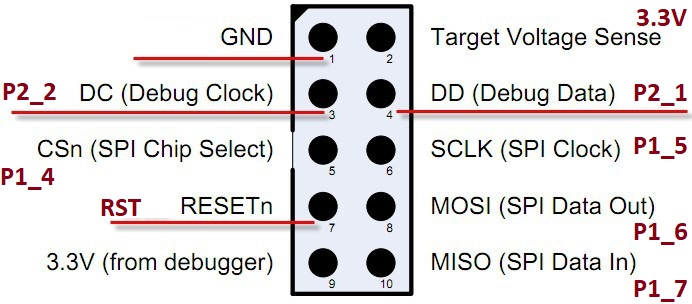
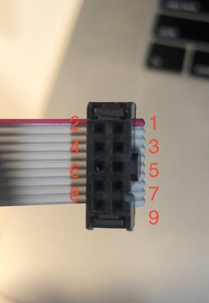
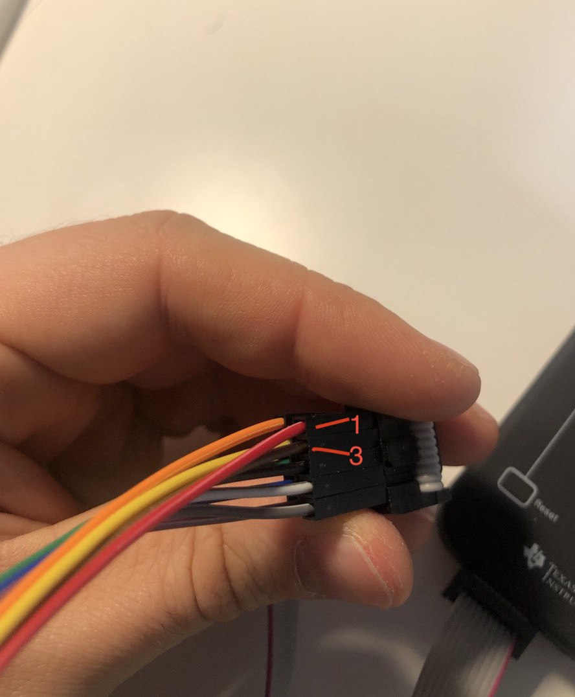

# How to flash CC2530

## cc-tools

Install

```
brew install autoconf automake libusb boost pkgconfig libtool
git clone https://github.com/dashesy/cc-tool.git
./bootstrap
./configure
make
```

Flashing

```
sudo ./cc-tool -e -w <hex path>
```

## Setup

How to connect pins:



Pins on cable is mirrored!





## Links

[ZigBee2MQTT flashing](https://www.zigbee2mqtt.io/getting_started/flashing_the_cc2531.html)
